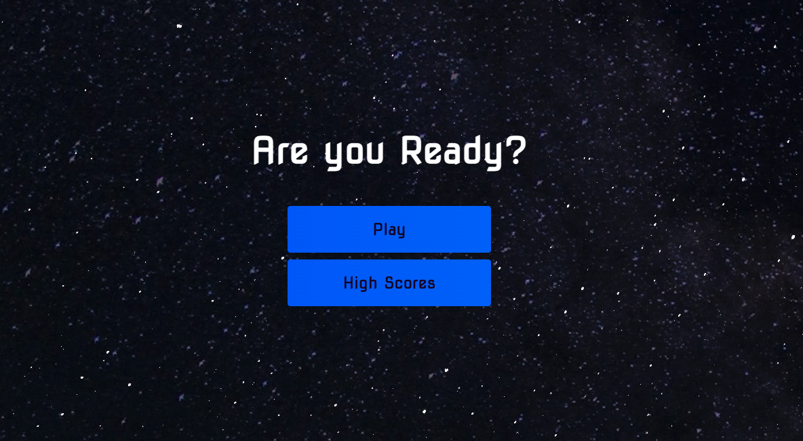

# Code-Quiz
This is a simple Javascript Quiz to help you gauge your knowledge on the subject matter.

HOW IT WORKS:

Once you click on the 'play' button you are taken to the game where a timer instantly begins to count down. The time starts at 75 seconds and will automatically end the game once it hits 0. When answering the multiple choice questions, the user will receive 100 points per correct answer. Therefore, if they get all 4 questions correct then they will have a total score of 400. Now if they do not get a question correct then they will be penalized by way of time. In the event of an incorrect answer the users time will automatically reduce by 15 seconds. 

At the end of the game, the user has the opportunity to writer their initials or name into the highscore box provided. Once they do, they will see previous highscore and can navigate back to the homescreen if they choose to do so. 

Coding languages: HTML, CSS, JavaScript

GitHub repository for my Password Generator: https://github.com/SarahLabrotLientz/Code-Quiz

URL to live website: https://sarahlabrotlientz.github.io/Code-Quiz/

